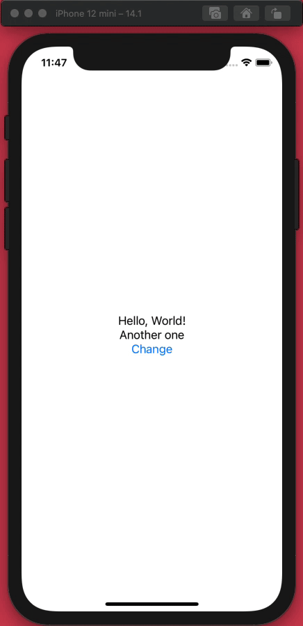

# ObjectView-POC
POC of using SUIObject to manage a View

## Example Code
```swift
import SwiftUI
import SUIObject

struct ContentView: View {
    var body: some View {
        Object("Hello, World!") { obj in
            obj.add(variable: "otherText", value: "Another one")
            obj.add(function: "change", value: { _ in
                obj.variables["otherText"] = "\(obj.otherText.stringValue() ?? "")+"
            })
        }.view { obj in
            VStack {
                Text(obj.stringValue() ?? "-1")
                Text(obj.otherText.stringValue() ?? "-2")
                Button("Change") {
                    obj.run(function: "change")
                }
            }
        }
    }
}
```

## Demo Video

